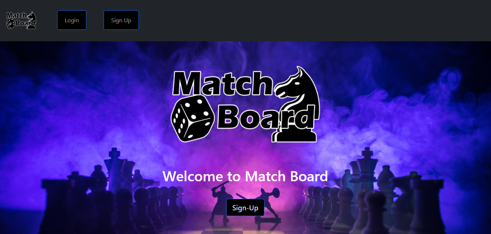
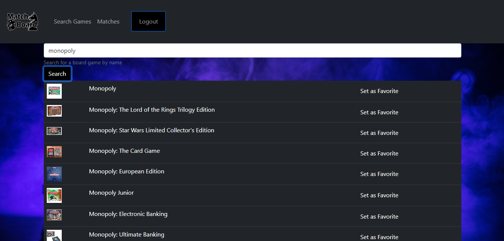
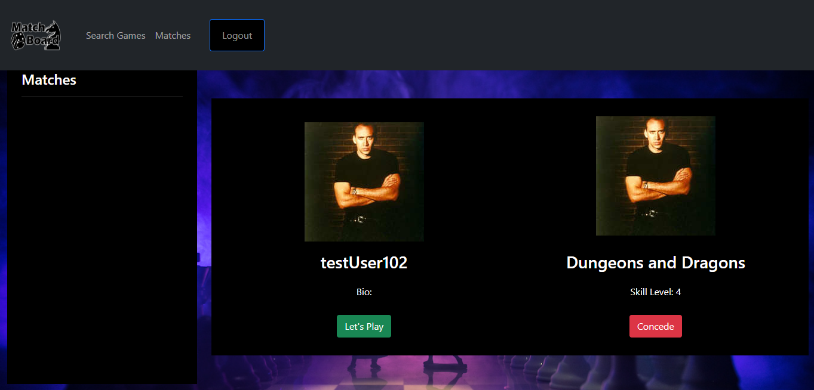

# Match Board

## Table of Contents

* [Description](#description)
* [Technologies](#technologies-used)
* [Usage](#usage)
* [Contribution Guidelines](#contribution-guidelines)
* [License](#license)
* [Contributors](#contributors)
* [Contact](#contact)
    
## Description

Are you looking to meet new people to play boardgames with or wanting to add another member to your group for monthly board game night? Maybe you just want to search for a new game to play with your friends.
Then try MatchBoard!
MatchBoard is the app you need to find your new group of friends to play that late night game of Monopoly with or have an epic campaign of Dungeons and Dragons!

## Technologies Used

React

Node.js

MySQL

Sequelize

Express

Bootstrap

## Usage
MatchBoard is a web application aimed at connecting users based on board game preferences and interests. Users select tabletop games they are actively playing or trying to find people to play with. This data then dictates which other gamers they are likely to match with. 

## Contribution Guidelines
No contributions permitted

## License
*This project uses the MIT license.*

*Read more about it by clicking the link below*

[License Link](https://choosealicense.com/licenses/mit/)

## Contributors
[Kyle Burt Github](https://github.com/burtk33)

[Chinedu Chukwuani Github](https://github.com/Chinedu613)

[Marco Estrada Github](https://github.com/MarcoC007)

[Mike Ruane Github](https://github.com/geotecdev)

[Alex Chisar Github](https://github.com/Arivas00)

## Contact

Kyle Burt: burtk33@gmail.com

Chinedu Chukwuani: cchukwuani@gmail.com

Marco Estrada: marco2110estrada@gmail.com

Mike Ruane: mikeruanedev@gmail.com

Alex Chisar: a.chisar00@gmail.com
